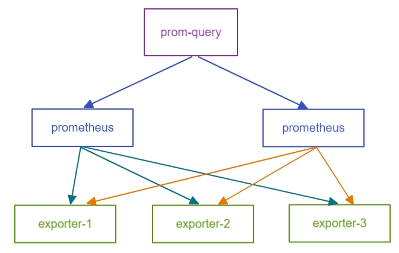

## prom-query

prometheus high-availability usually can be achieved by multiple instances, each instance pulls the same exporters.

prom-query provider query APIs, which do queries to multiple prometheus instance, **de-duplicate same series**, then return to client.



## How to use it

### 1. init

```
urls := []string{
    "localhost:9090",
    "localhost:9091",
}
var configs []*api.ReadConfig
for _, url := range urls {
    configs = append(configs, &api.ReadConfig{
        URL:     fmt.Sprintf("http://%v", url),
        Timeout: 30 * time.Second,
    })
}
api.Init(configs)
```

### 2. query instant

```
query := `up`
res, err := api.Query(query)
```

query result:
```
{"data":{"resultType":"vector","result":[{"metric":{"__name__":"up","instance":"127.0.0.1:9100","job":"node-exporter"},"value":[1669971395,"1"]}]},"status":"success"}
```

### 3. query range

```
query := `up`
endTs := time.Now().Unix()
startTs := endTs - 300
res, err = api.QueryRange(query, startTs, endTs, 60)
```

query range result:
```
 {"data":{"resultType":"matrix","result":[{"metric":{"__name__":"up","instance":"127.0.0.1:9100","job":"node-exporter"},"values":[[1669971095,"1"],[1669971155,"1"],[1669971215,"1"],[1669971275,"1"],[1669971335,"1"],[1669971395,"1"]]}]},"status":"success"}
```
